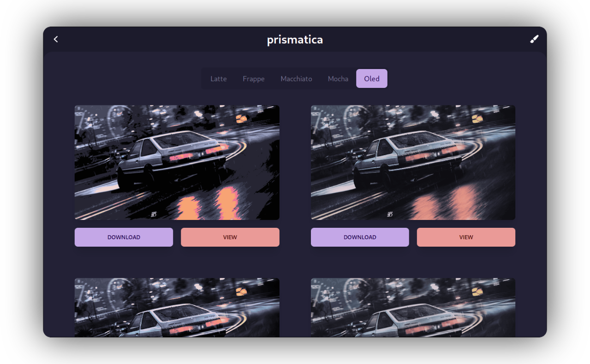

<div align="center">

```ocaml
Prismatica
```


<samp>Color correct wallpapers to match your setup!</samp>

---
<div align="left">

> 🚧 ~ This project is in early stages

## <samp> Installation </samp>
- Releases tab
- AUR *(todo)*
- Build manually

## <samp> Building </samp>
Make sure to install dependancies:
```sh
rustup
node

# linux only
libgtk-3-dev libwebkit2gtk-4.0-dev libayatana-appindicator3-dev librsvg2-dev
```

Clone repo
```sh
git clone https://github.com/ahmedmahmud/prismatica.git
cd prismatica
```
Install front end dependancies
```sh
npm install
```
Build the tauri app
```sh
npm run tauri build
```
The output directory for the binary is
```
./src-tauri/target/release
```

## <samp> Usage </samp>
There are two ways to use this app:
- GUI
- CLI

### GUI
Run the application
```sh
./prismatica
```
Choose a file you want to upload, pick the palette and press `Generate`
From there you can pick what palette of the theme you want, in each tab all the listed images are of different noise levels. Choose which you find best and press download, the image will then automatically be downloaded to the directory you ran the application. Press view to full screen the image to get a better look

### CLI
Run the CLI with the path to the input image, the theme, the palette and the noise level
```sh
./prismatica path/to/image.png -t catppuccin -p mocha -n 2
```
This will create a file `mocha-image.png` for your converted image

## Issues
- Downloading will put file in current dir, if run through a launcher this may be awkward.   
*Show directory picker?*
- Download crashes AppImage  
*AppImage needs file picker, will also resolve previous issue*
- ~~Switching between tabs quickly causes too many requests to backend and may crash your app.  
*No way to cancel promises, may switch multithreading completely to backend*~~  
**Fixed** w/ job pooling and caching

- Possible memory leak?  
  - ~~Rust~~  - **Fixed**, rewrote image processing handlers, previously would quickly climb to OOM
  - Front end - 
    *WebKit View holds a lot of memory for some reason, may be issue with tarui IPC*

- ~~Switching tabs doesn't cache previous images, will re-generate  
*Cache these on either frontend or backend*~~  
**Fixed**, added caching on front end

## Todo
- Fix all issues
- Add more palettes
  - Rose pine
  - Nord
  - Everforest
- Multi file selection / batch jobs